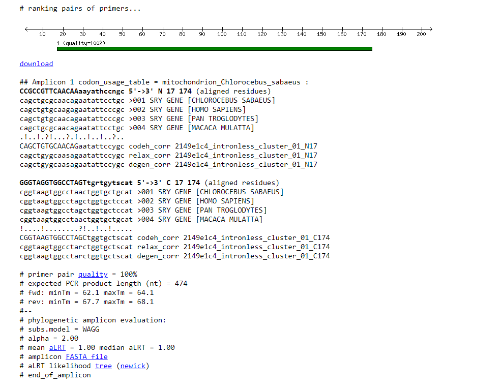

# BIOINFORMATICA 2 
## Alineamiento de secuencias 

### Parte 1: Colectar genes homologos
1.__¿Qué función cumple el gen SRY?__ El gen SRY codifica un factor de transcripción (TDF) proteína que se une al DNA, otorgando características masculinas al individuo

2.__¿Cuántos genes ortólogos están anotados en esa base de datos?__ Aparecen 27 ortólogos del gen SRY en NCBI

### Parte 2: Alineamiento múltiple
1. __¿Qué es el EMBL-EBI?__  Es un página web del instituto de bioinformática europeo, además es parte del Laboratorio insigne europeo para las ciencias de la vida, provee un base de datos de investigaciones, herramientas de bioinformática y aprendizaje.
2. __¿Cuántos tipos de alineamiento múltiple se pueden realizar en EMBL-EBI?__ partiendo por el alineamiento de interés nuestro de mRNA, también se puede de proteínas, DNA, estructuras proteicas, drogas etc.
3. __¿Cuál es el programa que ellos ofrecen que funciona mejor para secuencias de proteínas?__ en Data submission se orienta al usuario a elegir la mejor opción dependiendo de la información que se posee, sin esta ayuda el mejor programa es el MUSCLE el cual otorga información más precisa.
4. __¿Qué otros tipo de herramientas ofrece EMBL-EBI?__ alineación de secuencia para proteínas, DNA, RNA, Predicción de funcionalidad proteica por su estructura, compatibilidad de posibles drogas, alineación de secuencias y posibles moléculas. 
5. __¿Cuál es el costo de abrir un gap?__  el costo de abrir un gap es de 1.53
6. __¿Cuál es el costo de extender un gap?__ el costo de extender el gap es de 0.123
7.__¿Cuál es la longitud total del alineamiento?__  la longitud del alineamiento es de 1905bp 
8.__¿Cuál es la especie cuyo gen SRY está más relacionado con el gen SRY de humanos?__ la especie más cercana al SRY humano es el _pan trogodytes_ con nombre común chimpancé
9. __¿Cuál es el más lejano?__ el más lejano es gavia stellata comúnmente conocido como colimbo chico
10. __¿Cuál es la especie cuyo gen SRY es más cercana a la del burro?__ el ancestro más cercano al gen SRY del burro es el Equus_przewalskii conocido como caballo mongol o takhi
11. __¿Cómo esperas que sea el alineamiento si el costo de abrir un gap aumenta? ¿Y si disminuye?__ si el costo del gap aumenta las coincidencias entre las distintas especies disminuirán y por lo tanto habrá menos alineamiento, si disminuye se asumirá que algunas secuencias están alineadas y puede que no sea así, permitiendo más errores de lo estimado.
12. __¿Cómo esperas que sea el alineamiento si el costo de extender un gap aumenta? ¿Y si disminuye?__ si el costo de extender un gap aumenta muchas secuencias que si son cercanas aparecerán con bajo porcentaje de coincidencia disminuyendo el alineamiento final, si lo aumentamos las secuencias tendrán una coincidencia irrisoria, entregando resultados de alineamiento muy altos pero a la vez erróneos.

13. __¿Cuál fue el efecto de aumentar el costo de abrir un gap en la longitud total del alineamiento de 1.53 a 2?__ los resultados fueron nulos se infiere que esto haya ocurrido debido a que existe una conservación evolutiva de los genes bastante sólida, y cuando se llevó al mínimo la longitud disminuyo esto debido a que las secuencias abiertas fueron más cortas.
 ### Parte 3: Diseño de partidores

 
 
